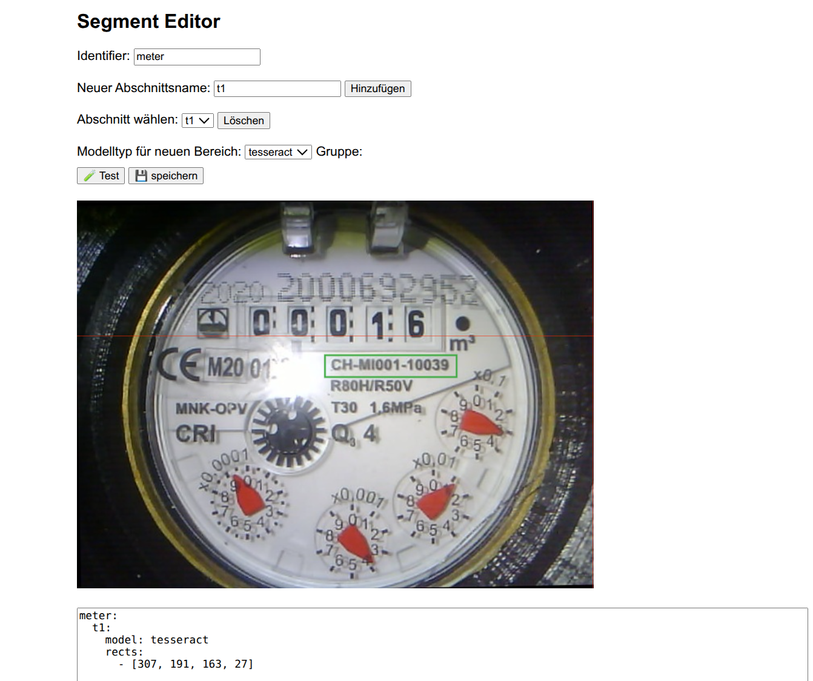

... work in progress

# 🔍 Segment Editor + OCR for Meter Readings

A Flask-based web tool for interactive configuration and recognition of analog and digital meter displays – using TFLite models, Tesseract OCR, and image segmentation.

It's mainly thought o be used in HA to send a picture of a meter and to generate values on the server side.

## 🚀 Features

- 📤 Upload custom meter images
- ✏️ Interactive drawing of image segments
- ⚙️ YAML-based configuration generation
- 🧠 Supports:
  - TFLite digital models (`digital`)
  - TFLite analog models (`analog`)
  - Tesseract OCR (`tesseract`)
- 🔁 Test and save configuration directly in the browser
- 🎯 Live inference via the `/segment` API

## 🖼️ Screenshot



## 🧑‍💻 Getting Started Locally

### Prerequisites

- Docker + Docker Compose

### Start the Application

```bash
docker-compose up --build
```

Then open: [http://127.0.0.1:5000](http://127.0.0.1:5000)

## 🧪 Workflow

1. 📷 Upload a meter image via `/`
2. 🖱️ Draw segments using the editor (`/editor/<image>`)
3. ⚙️ Assign model type and segment group (e.g., `pre-decimal`, `post-decimal`, or `rects`)
4. 💾 Save the YAML config
5. 🔍 Click "Scan" to test inference with the selected config

## ⚙️ API Endpoints

| URL                 | Purpose                        |
|---------------------|--------------------------------|
| `/`                 | Upload a new image             |
| `/editor/<image>`   | Interactive segment editor     |
| `/segment`          | Run inference on an image      |
| `/test-config`      | Test/save YAML configuration   |
| `/images/<file>`    | Access uploaded images         |

## 📁 Project Structure

```
.
├── app.py              # Flask app with OCR and inference logic
├── templates/editor.html  # Browser-based segment editor
├── config.yaml         # YAML config storage
├── models/             # .tflite models
├── images/             # Uploaded images
├── Dockerfile
├── docker-compose.yaml
└── requirements.txt
```

## 🔗 Related Projects

- [jomjol/AI-on-the-edge-device](https://github.com/jomjol/AI-on-the-edge-device) – OCR system for ESP32 camera-based devices

## 📖 License

MIT License – free to use with attribution.\
the tflite files are under ownership of AI-on-the-edge-device and others and the corresponding rules do apply ...

## Todos
- send generated values to a MQTT server  - done V0.91
- allow match: <regex> patterns to validate resulsts . done V0.92-test
- allow custom code to work on scanned values and to modify return values. done V0.92.1
- allow simplified model names in config.yaml. done V0.92.1
- correct handling of digital models: -cont, -11, 100. done V0.92.1
- add a possible rotation to the image. done V0.92.1


