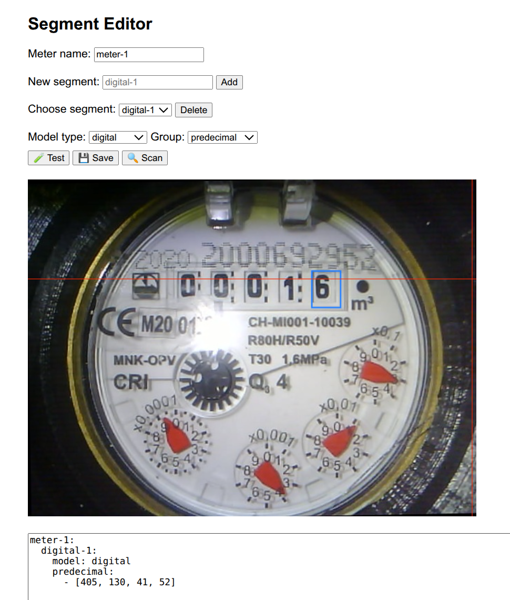

# ocr-server

This projects creates a docker image which can process pictures of meters and extract the values.\
(similar to AI on the EDGE but doing ot on the server side and expanding by use of tesseract)

Currently it's using the following models:
- tesseract
* tensorflow: Digital (AI on the EDGE)
+ tensorflow: Analog (AI onn the EDGE)

### Disclaimer
Status: concept work / or work in progress\
It's reusing some of the AI on the EDGE results (Tensorflow flite models)\
[AI-on-the-edge-device](https://github.com/jomjol/AI-on-the-edge-device)

## Scan a picture and generate values
Send a request f.e. via curl:

`curl -X POST http://localhost:5000/segment   -F "identifier=wasserzaehler"   -F "image=@./t4.jpg"`

`{"identifier":"wasserzaehler","results":[{"id":"a1","value":"00016.0"},{"id":"a2","value":9.127448058121708},{"id":"a3","value":3.881748198574262},{"id":"anzeige1","value":1.2311287412814798},{"id":"a5","value":3.345734090629815}]}`

## Segment Editor
You can use http://127.0.0.1:5000/ to upload a new meter picture and to generate and test the yaml config for this meter.

